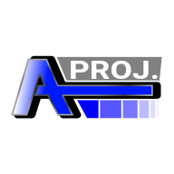

# Techno War

Game Application for cross platform with independent window management and API initialization. Mainly writen as c++.

## Table of Contents

1. [Core](#core)
2. [Platforms](#platforms)
   - [Android](#android)
   - [IOS](#ios)
   - [Windows](#windows)
   - [Unix](#unix)
3. [Dependencies](#dependencies)
3. [License](#license)

## Core

The main logic of game.

## Platforms

### Android

Currently support Android API 34 (min. 24).
Graphics API usage: OpenGLES 3.2
Audio usage: not yet.
Input support: Touchscreen motion.
Asset reader: Android Asset Manager.
Internet implementation: not yet.

### IOS

Not yet.

### Windows

Windows support 32 bit.

Graphics API usage: Not yet.
Audio usage: not yet.
Input support: Not yet.
Asset reader: Not yet
Internet implementation: not yet.

### Unix

Graphics API usage: Not yet.
Audio usage: not yet.
Input support: Not yet.
Asset reader: Not yet
Internet implementation: not yet.

### MacOS

Not yet.

## Dependencies
Thanks for 🙏
- @nothings for stb/stb_image as image decompressor
- @dharani811 for bmfont/bmfont as .fnt parser

## License

This project has maded by myself.
