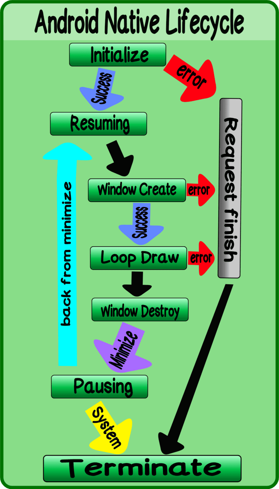
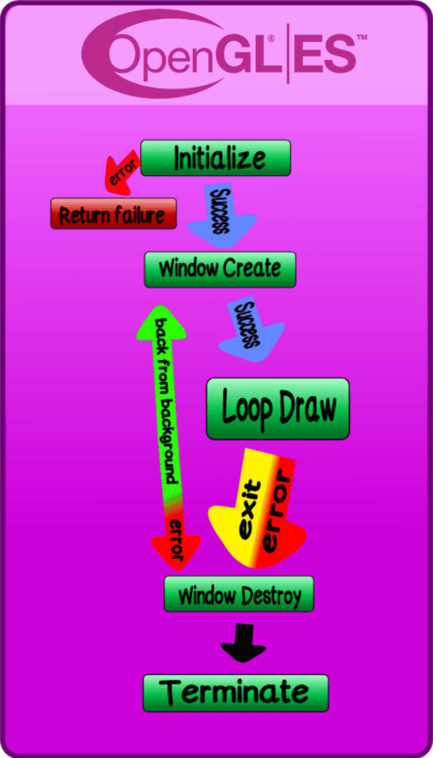

# Android

1. [Main](#main)
2. [Audio](#audio)
3. [Input](#input)
4. [Asset](#asset)
5. [Graphics](#graphics)
    - [OpenGLES](#opengles)
    - [Vulkan](#vulkan)

## Main

## Audio
Not implemented yet.

## Input
Not implemented yet.

## Asset
Not implemented yet.

## Graphics
### OpenGLES

### Vulkan